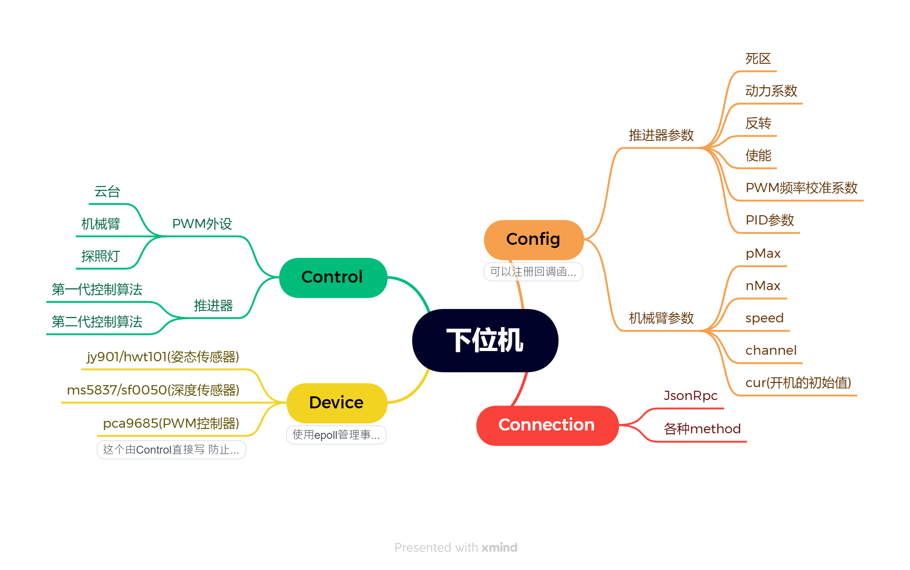
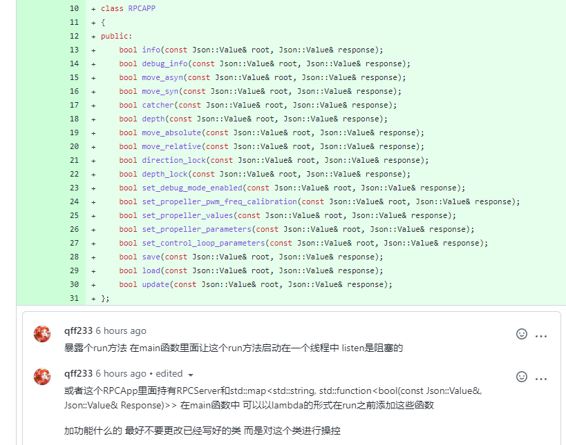

# rov-master-v2

### 架构图



## 变量

- 线程变量`t_`开头

```c++
static thread_local t_exampleVar;
```

## 函数

- 变量大写开头

```c++
 int GetPID();
```

- ***不抛异常**在后面加上 `noexcept`*

## 类和结构体

##### 设计思路

- 使得后续的修改应尽可能小的修改类的代码

  

##### 命名

1. 开头大写 驼峰命名
2. 类内成员变量 `m_` 开头
3. 类内静态变量`s_`开头
4. 类内方法小写开头 (**不抛异常**在后面加上 `noexcept`)
5. 类内静态方法大写开头

```c++
class Example 
{
public:
    int getMemberVar() const noexcept;
    int GetStaticVar() const noexcept;
private:
    int m_memberVar;
    static int s_staticVar;
};
```


##### 实现

- 统一放到`.cpp`文件中


## 标准库容器的使用

##### vector

- 能知道大概分配多少先`resize` (避免扩充大小时的数据拷贝性能损失)

##### list

- 删除 添加操作多时使用

## 下位机驱动类规范

#####  三个基本成员函数

```c++
1. void reset();
2. void inputDate(uint8 data)
3. const jy901_t& getDate() const
```

> 后续添加了事件系统后 还应暴露出当这个驱动事件触发时要执行的函数
